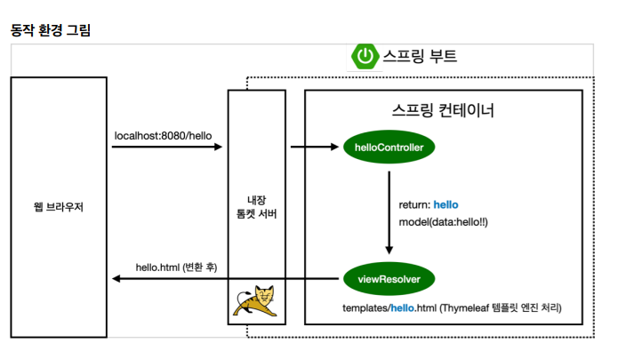

# Mindfulness Project 

## 🔽 개발환경
- 개발언어: java, HTML5, Javascript, XML, JSON
- 개발도구
- 프레임워크
- 데이터베이스:
- WAS : Apache TomCat

## ✔ 목표 
- 경기침체가 장기화되는 가운데, 불안감 속에서 살아가는 현대인들을 위한 마인드 케어 웹 홈페이지 
- 간단한 반응형 웹 홈페이지 형태로 Spring framework로 제작, view template는 드림코딩 등을 시청하며 홈페이지 꾸려 나가기 

### 개발 목표
<Software Engineering 적용>
- 요구사항 정의해보기
- usecase 정의해보기 
- TDD 적용
<CI/CD, 배포까지 적용>
- CI/CD Tool

### 공부 환경
- 지속적으로 자극받으면서 기술 적용할 수 있는 환경에 대해 고민하기
  - 스터디, 교육

## Daily Implementation
- 23/07/25: 간단한 Controller, 웹 홈페이지 구축 
- 

### REVIEW

**[MindfulnessController.java]**
- `return "minfulness";` 는 resource/template 밑의 폴더(mindfulness)를 찾아 렌더링한다. 